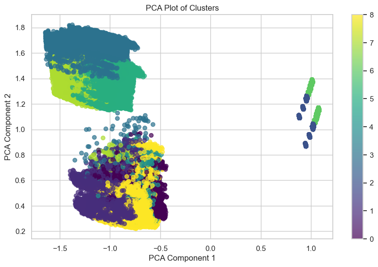
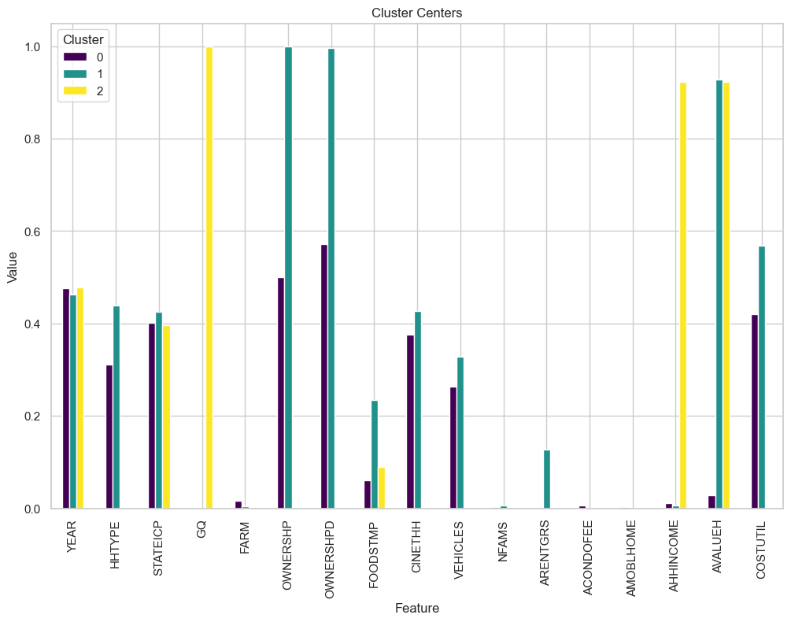
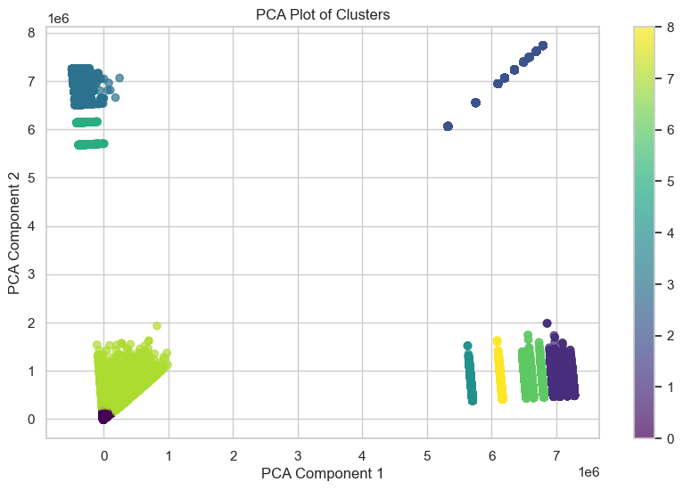
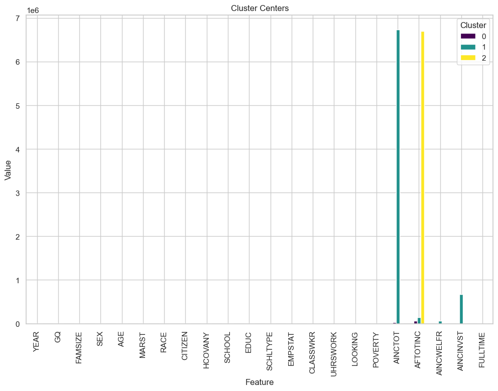
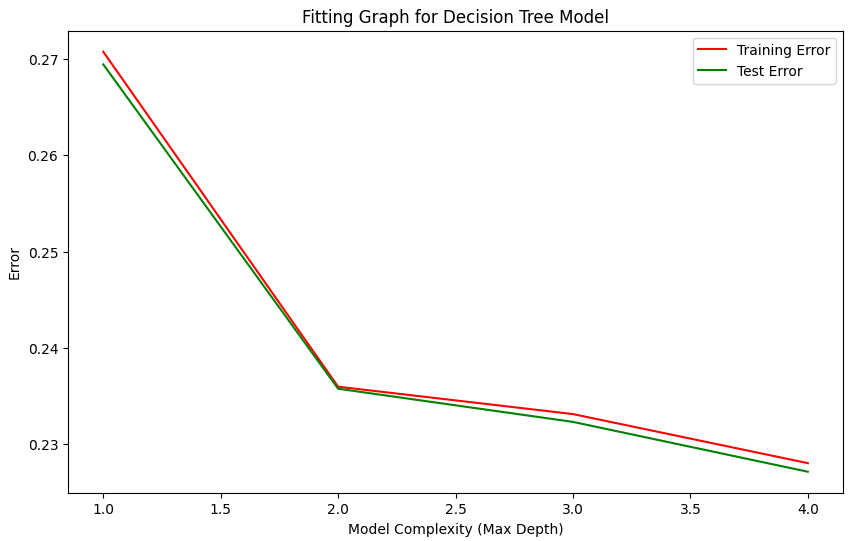

# Examine US Happiness Trends with census data.
UCSD Spring 2024 232R Big Data Analytics Using Spark Group Project  
**Team Members:** Taylor Witte, Donald Yu, Praveen Manimaran, Vitush Agarwal, Parker Aman

# Introduction 
Homeownership is a cornerstone of economic stability and social well-being, affecting financial security, health outcomes, and community involvement. Understanding the factors that predict whether individuals own or rent their homes is essential for addressing housing inequality and creating effective housing policies. This study delves into these factors by analyzing extensive individual and household data from the American Community Survey (ACS) for the years 2012 to 2022, excluding 2020 due to the COVID-19 pandemic.

The decision to focus on home ownership and renting was motivated by their significant implications on Americans. Owning a home often provides a sense of security, while renting can reflect different socio-economic conditions. The ability to accurately predict home ownership can thus inform policies that aim to increase housing affordability and accessibility, reduce socio-economic disparities, and improve overall quality of life.

The approach of utilizing advanced data analysis techniques and machine learning models to predict home ownership is particularly exciting due to the potential insights and applications it offers. By leveraging the computational power of the Spark framework and the resources of the San Diego Supercomputer Center (SDSC), this study analyzes large-scale datasets efficiently. The integration of K-means clustering, Principal Component Analysis (PCA), Decision Trees, and Logistic Regression in predictive modeling allows for a detailed understanding of the factors that influence home ownership and renting.

The datasets utilized in this study include individual and household census data from the ACS, encompassing over 10 million individuals. [A description of the Datasets and their variables can be found in the Dataset Description.](Dataset_Description.md) Key variables include demographic information such as age, race, and citizenship status; socioeconomic factors like education attainment, class of work, and total household income; and housing-related details such as group quarter status, household type, and ownership status. By combining these massive datasets, the study provides a comprehensive view of the diverse factors influencing home ownership.

The broader impact of developing a reliable predictive model for home ownership is substantial. Accurate predictions can guide policymakers in designing targeted interventions to support potential homeowners, especially in underrepresented and disadvantaged communities. Moreover, these models can help financial institutions in offering tailored mortgage products. For urban planners and social scientists, understanding the dynamics of home ownership can lead to better resource allocation and community development strategies.

# Methods 

## Data Exploration
For each dataset, we first looked at the number of null/missing values and took steps during preprocessing to address these issues. We also look at the number of rows and the number of variables(decide which variables to use later) and the years represented in the dataset.

Happiness Dataset: Explored the distribution of different variables such as Life Ladder, Log GDP Per Capita, Social Support, Healthy Life Expectancy at Birth, Freedom To Make Life Choices, Generosity, Positive Affect, Negative Affect, and Confidence in National Government. We also plot these variables over time to see the trends of these variables from 2012 to June 2022. We were able to notice to that that since the first year of that the report was created was in 2012 and there have been big changes since then with the happiness score decreasing over time. 

Individual Census Dataset: We investigate each variable individually, and plot the distributions of all the relevant variables to see any trends and patterns. We plotted the distribution of the entire dataset as well as demographic variables(Age, Race, Education), Marital Status Distribution, Distribution of Family sizes, Health Insurance Coverage Distribution, Employment Status Distribution, and the Hours worked per Week Distribution. 

Household Census Dataset: From initial exploration, we found that the number of households for those individuals decrease overtime and realized further analysis needs to be done to understand why. We also explored the distribution of household types(married couple family, male_no_wife, female_living_alone, etc). We also looked at the distribution of number of famileies per Household each year, housing unit types, and internet access for each household. We saw a decrease in the number of farms each year with the percentage of farms relative to households per year being fairly consistent. Our group alos saw a downward trend in the number of owned houses and explored the distribution of hosuehold weight per year. We plotted the average cost of electricity, gas, fuel, and water per year since 2012 and noticed a similar downward trend for each. The average number of vehicles increased from 2012 to 2020 but has decreased a lot from 2020 to 2022.

These data exploration methods allowed us to get a better understanding of which variables we should use and what variables need to be preprocessed before building our models.

## Preprocessing 
Variables were selected to be diverse enough to get a deep understanding of the US population and reflect the World Happiness Data variables but concise enough to be able to process. The distribution of all variables was examined to ensure the dataset was representative of the US population. For the household census dataset, each row represents an individuals but all variables were measured on a household level so the dataset was filtered to remove individuals within the same household to leave unique household instances. The World Happiness Report Dataset was filtered to only include US datapoints between the year of 2012-2022(except 2020 due to covid). All monetary variables were normalized for inflation to the 2000 dollar values. Variables that were missing from too many individuals and/or households will be removed from further analysis. For some selected categorical variables, categories were combined such as household definitions for the Group Quarters variable. For clustering, all variables were normalized using the MinMax Scaler to a 0-1 scale. Each column was scaled individually. The MinMax normalization function was selected to preserve the true distribution of each variable. Additonally,one-hot encoding was used to handle select categorical variables to create binary features. This allowed for more streamlined analysis of the variables.

## Model 1

The goal of the model 1 was to predict home ownership and renting using the individual and household datasets.
The Kmeans code first creates a "features" column in the dataset using PySpark's VectorAssembler, which consolidates all feature columns into a single vector column. This new DataFrame is then cached for efficient reuse. Next, the code determines the optimal number of clusters for K-means clustering by calculating the cost (sum of squared distances) for cluster numbers ranging from 2 to 9. The costs are plotted to visualize the elbow point, which helps in identifying the best number of clusters.The code performs K-means clustering on the dataset, setting the number of clusters to the suggested k cluster number from the elbow point. After fitting the K-means model and obtaining the cluster centers, it adds the cluster predictions to the DataFrame. Principal Component Analysis (PCA) is then applied to reduce the dimensionality of the features to two components, which are visualized in a scatter plot showing the cluster distribution. The cluster centers are plotted in a bar chart to illustrate the values of each feature per cluster. Also, a ClusteringEvaluator is used to calculate the silhouette score, providing a measure of the clustering quality.

In addition to the KMeans, Decision Tree was used to predict whether a house was owned or rented based on the four variables.  The code begins by splitting the dataset into training and testing sets using an 80-20 split. It identifies and removes irrelevant columns ("OWNERSHPD," "OWNERSHP," and "ARENTGRS") before assembling the remaining features into a single vector column for modeling. A Decision Tree Classifier is then trained on the training data, and predictions are made on the test data. The accuracy of the model is evaluated using a Multiclass Classification Evaluator. Feature importance is extracted and displayed, with a custom mapping applied to replace feature numbers and predicted class numbers with meaningful labels. Finally, the structure of the decision tree is printed with these labels, and the code calculates and prints the percentage of rented properties and those in group quarters.

## Model 2
The goal of model 2 was to predict ownership from individual demographic and household information. To begin, we chose several  variables that individuals have and do not have control of. The variables selected were Age, Race, Citizenship Status, Education Attainment, Class of Work, Marital Status, Number of own family members in the household, Number of families in the household, Group Quarter Status (Household vs Group Quarters), State, Year, Household Type (Married vs Single, etc), and Person Number in Sample Unit. To build this model we tested two types of models: logistic regression and decision tree. Both gave similar accuracy 74% and 78% respectively. We chose the decision tree which had a slightly higher accuracy and allowed for a more understandable model. The decision tree performed feature selection by only splitting on relevant features. To mitigate overfitting we only allowed for a maximum depth of the trees but did not limit the number of samples per split node. We did not consider the household weight which indicates how representative a household is of all households which could be included in further adaptations to decrease the bias of the model. We also ran this decision tree with the total household income and without, which gave some interesting results and will be discussed in further sections.

# Results 
## Model 1 

**Figure 1: Model 1 Household Census KMeans Clustering**

 
_Figure 1a: PCA Plot & Figure 1b: Kmeans Features_ 

**Figure 2: Model 1 Individual Census KMeans Clustering**

 
_Figure 2a: PCA Plot & Figure 2b: Kmeans Features_ 

For the Household Census Kmeans, The Cluster Center plots show the average values for each feature for the three clusters identified. Each bar represents a feature and its height reflects the mean value of that feature within the cluster. K-means idenified three clusters: households who own, households who rent and group quarters.The silhouette score is 0.351 indicating the clusters are not well-defined and distinct from each other.

For the Individual Census Kmeans, the Cluster Centers plot shows the average values of each feature for the three identified clusters. Each bar represents a feature, and its height reflects the mean value of that feature within the cluster. The features include demographic, socio-economic, and health-related variables. Notably, variables such as AINCTOT (total income), AFTOTINC (family total income), and POVERTY show significant differences across clusters, indicating that income and poverty status are key distinguishing factors among the clusters.
The silhouette score is 0.869, which is quite high. A high silhouette score close to 1 indicates that the clusters are well-defined and distinct from each other. The points within each cluster are very similar to each other and different from points in other clusters.

The decision tree was able to predict with 99% accuracy whether a house was owned or rented based on the four variables. First group quarters were excluded since they are neither rented or owned. 

## Model 2 

The decision tree including family income achieved a test accuracy of 77.9% and is represented in Figure 3. When family income was removed the model achieved a 77.1% test accuracy and is represented in Figure 4.

**Figure 3: Model 2 including Family Income Fearture**

**Figure 4: Model 2 excluding Family Income Fearture**

This fitting graph (Figure 5) shows as the complexity (depth of trees) increases, we do continue to see an increase in accuracy, however, it is trivial. We can see the best depth to pick is 2. After this, the marginal increase in accuracy is not worth it.

**Figure 5: Model 2 Fitting Graph**

# Discussion 

## Model 1

The KMeans clustering on the Household Census Data yielded a silhouette score of 0.351, indicating poorly defined and overlapping clusters. This suggests that households classified as owners or renters are similar across other metrics, making it challenging for the model to form distinct clusters. Increasing the number of clusters might help create more nuanced and distinguishable groups, but the current results highlight the limitations of KMeans for this dataset. In contrast, the KMeans clustering on the Individual Census Data resulted in a high silhouette score of 0.869. This indicates that the clusters are well-defined, with high internal similarity and low external similarity. The clustering model effectively grouped individuals into distinct clusters, suggesting that individual-level data provides clearer distinction compared to household-level data.

The  disparity in silhouette scores between the Household and Individual Census Data suggests that KMeans may not be suitable for predicting homeownership solely based on household metrics. The high silhouette score for individual data indicates that personal demographics and attributes contribute more distinctly to clustering outcomes. Combining both datasets and reapplying KMeans clustering could potentially reveal more insightful patterns and improve cluster definition.

One limitation of our current approach is the reliance on KMeans clustering, which may not capture the complex relationships between variables in the Household Census Data. Future work could explore alternative clustering algorithms, such as hierarchical clustering or DBSCAN, which might better handle the nuances in the data. Additionally, incorporating more features in the datasets could provide a better context for analysis. Combining the Household and Individual Census Data and applying clustering techniques could lead to new insights and improve our understanding of the factors influencing homeownership. This integrated approach may help identify more granular patterns and enhance the overall predictive accuracy of our models.

The high accuracy and clear decision rules suggest that the Decision Tree model effectively captured the key determinants of homeownership. The predominance of "HOUSE_VALUE" and "GROUP_QUARTERS" aligns with the intuitive understanding that property value and living arrangements significantly influence homeownership status. However, the model's heavy reliance on a few key features raises concerns about its ability to generalize. Although it performs well on our current dataset, it might not work as effectively with different data or additional features. Additionally, leaving out factors like household income dynamics and individual demographics may limit the model's overall accuracy and depth. Future work should consider integrating more variables in the datasets to enrich the feature set. Combining household and individual data could provide deeper insights into the determinants of homeownership. Exploring other models or incorporating clustering techniques to preprocess and segment the data might further enhance predictive accuracy and robustness.

## Model 2
The decision tree trained with household income (Figure 5) chose total household income, age, marital status, family size, household type, and race as features used to predict ownership of homes. Interestingly, year was not selected as a feature indicating it does not have an important impact on an individual's ability to own a home. This could be due to the data not indicating when the home was bought and who the owner of the home is. To be able to determine if it was harder to buy a house in 2022 compared to 2012 that data would be needed. It is expected that income would be the most important indicator of ownership. It makes sense that age is an important factor since older people are more likely to settle down and have longer to save for a home. Interestingly, even within older age groups and the same household income marriage, race, and whether or not an individual had children was a differentiator between owning and renting. Family size and Household Type could have been overrepresented since we put all individuals into the model and did not filter for just the head of household potentially leading to families being overrepresented.

When income was removed as a variable and the decision tree classification was re-run (Figure 6), the model was still able to predict homeownership with similar accuracy. This decision tree selected Household Type, Citizenship Status, Age, Race, Education, Person Number in the Household, and Family Size. Person Number in Household and family size are most likely similarly representing a family that lives in the household. Although there were multiple categories of race, being white or not was the only distinguishing factor. It also appears gender which was not included as an option had an impact through Household Type. Additionally, it is worth noting the education variable didn't indicate whether an individual had received a college degree or not but splits on 4 or more years of college vs less than 4 years of college may be selecting individuals with college degrees. 

In future work, including household weight would increase the power of these results to ensure it is representative of the population. Rather than including all individuals only including the head of the household may provide more representative results. It also would be interesting if variables such as whether an individual was retired or not when the home was bought, and whether an individual had inheritance or help from family.

# Conclusion 
This study aimed to find the factors influencing home ownership versus renting by leveraging large-scale datasets from the American Community Survey (ACS). Through the development and application of K-means clustering and Decision Tree models, we identified key demographic and socioeconomic variables that predict housing status. The models demonstrated the significant impact of variables such as age, race, citizenship status, education, employment class, marital status, and household composition on home ownership.

Reflecting on the research process, several areas for improvement and future exploration emerge. The KMeans clustering on the Household Census Data yielded a low silhouette score of 0.351, suggesting poorly defined and overlapping clusters. This suggests that households classified as owners or renters are similar across other metrics, making it challenging for the model to form distinct clusters. In contrast, the KMeans clustering on the Individual Census Data resulted in a high silhouette score of 0.869, indicating well-defined clusters. This disparity suggests that individual-level data provides clearer distinctions compared to household-level data. Combining both datasets and reapplying KMeans clustering could potentially reveal more insightful patterns and improve cluster definition.

One limitation of our current approach is the reliance on KMeans clustering, which may not capture the complex relationships between variables in the Household Census Data. Future work could explore alternative clustering algorithms, such as hierarchical clustering or DBSCAN, which might better handle the nuances in the data. Additionally, incorporating more features in the datasets could provide a better context for analysis. Combining the Household and Individual Census Data and applying clustering techniques could lead to new insights and enhance our understanding of the factors influencing homeownership.

The high accuracy and clear decision rules of the Decision Tree model suggest that it effectively captured the key determinants of homeownership. The predominance of "HOUSE_VALUE" and "GROUP_QUARTERS" aligns with the intuitive understanding that property value and living arrangements significantly influence homeownership status. However, the model's heavy reliance on a few key features raises concerns about its ability to generalize. Future work should consider integrating more variables in the datasets to enrich the feature set. Exploring other models or incorporating clustering techniques to preprocess and segment the data might further enhance predictive accuracy and robustness.

Final thoughts highlight the importance of this research in informing housing policies and contributing to social and economic well-being. Accurate predictive models of home ownership can guide interventions aimed at increasing housing accessibility and affordability, particularly for marginalized communities. By continuing to refine these models and explore new avenues of research, we can better understand the dynamics of home ownership and develop strategies to foster more equitable housing opportunities.

# Collaboration 
- **Taylor Witte: Project Manager** I set up and organized the GitHub and dataset. In addition, I organized meetings and GitHub projects for each milestone with milestones and issues to plan and split up the execution of our project. For Milestone 1, I generated and imported the dataset into the pyspark. For Milestone 2, I decoded the variables and their categorical encodings, performed null analysis, adjusted monetary variables for inflation, generated exploratory graphs to understand Individual Technical Variables, Household Technical Variables, Household Composition Variables, and the World Happiness Dataset, and contributed to the readMe. For Milestone 3, I performed preprocessing, scaling, and transformation for both household and individual variables, evaluated FlowSOM clustering for individual data which unfortunately was not useable, evaluated the household K-Means analysis, developed a decision tree household model, and contributed to the readME. For Milestone 4, I combined the household and individual datasets,  built the decision tree model with and without Household Income, generated readable graphics of the Decision Tree, and contributed to the ReadMe Methods, Results, and Discussion sections. 
- **Vitush Agarwal: Coder/Writer** For Milestone 1, I aided in group meetings to find and select a dataset for our project. For Milestone 2, I explored the household variables surrounding utitlies including water, gas, and electric as well as houshold cars. For Milestone 3, I evaluated a FlowSOM clustering on the household data which unfortunatley was not useable. For Milestone 4, I reviwed sections of our code to make sure it was properly commented. I also wrote both the ReadME Introduction and Conclusion for our final submission.
- **Donald Yu: Coder/Writer** For Milestone 2, I conducted data exploration on a few variables in the Individual Census data set. I generated and evalauated the usefulness of the variables. On Milestone 3, I developed and implemented the KMeans for the Model 1's Individual Census KMeans. I provided insights to the results and predictions of the KMeans. Collaborated with team in improving the SparkSession builder to optimize the runtime. Assisted with the Milestone 4 final README writeup 
- **Parker Aman: Coder/Writer** For Milestone 2, I explored the household income and home value variables. I also explored the individual income and poverty scores. For Milestone 3 I split the dataset into train and test sets for us to use for our models. I also built and evalutated the k means clustering model using the household data. For Milestone 4, I collaborated with Taylor to build or decision tree model for Model 2. I also evaluated the model and created the appropriate fitting graph. Lastly, I contributed to the ReadMe Methods and Results sections.
- **Praveen Manimaran:**
